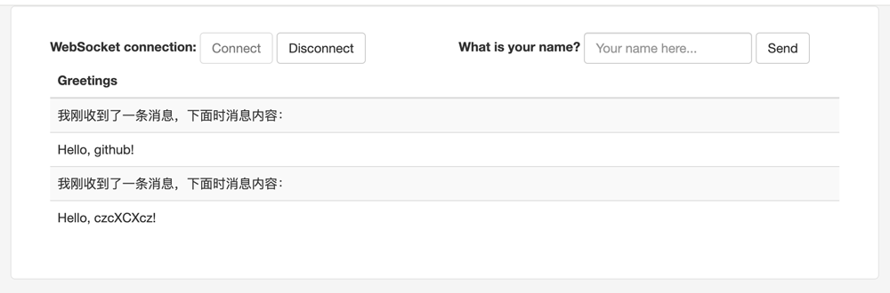

# spring-boot-websocket-demo

WebSocket and SseEmitter

https://spring.io/guides/gs/messaging-stomp-websocket

https://github.com/spring-guides/gs-messaging-stomp-websocket


```
http://localhost:8080/
```


